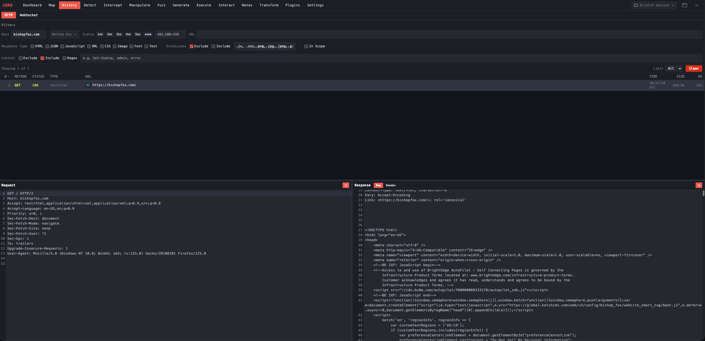

# Joro

A web exploitation framework for offensive security professionals. Intercepting proxy, blind vulnerability detection, web shell generation, C2 integration, and collaboration tools in a single binary with an embedded web UI.

> Warning: This tool is intended for authorized penetration testing and security research only. You must only use Joro against systems you own or have explicit written permission to test. Unauthorized access to computer systems is illegal. Bishop Fox assumes no liability and is not responsible for any misuse or damage caused by this tool. Use responsibly.

## Features

Joro covers a web application engagement end to end: an intercepting proxy for viewing and editing requests and responses, a site map and searchable history, a fuzzer, passive scanning that surfaces secrets and misconfigurations in captured traffic, out-of-band listeners for blind vulnerabilities, web shell generation and execution, Sliver and Mythic C2 integration, and a team server for running an engagement alongside other operators. Work saves to portable project files, and Go plugins enable Linux and macOS users to add anything missing.

## Installation

Grab a binary from [Releases](https://github.com/BishopFox/joro/releases), then see the wiki for [installation instructions](https://github.com/BishopFox/joro/wiki/Installation) and a [quick start guide](https://github.com/BishopFox/joro/wiki/Getting-Started).

## Help

For more information:
- Checkout the [wiki](https://github.com/BishopFox/joro/wiki)
- Review outstanding [issues](https://github.com/BishopFox/joro/issues) or [create your own](https://github.com/BishopFox/joro/issues/new/choose).
- See [CONTRIBUTING.md](https://github.com/BishopFox/joro/blob/main/CONTRIBUTING.md) for information on how to contribute.
- See [CLAUDE.md](https://github.com/BishopFox/joro/blob/main/CLAUDE.md) for detailed developer documentation.
- See [SECURITY.md](https://github.com/BishopFox/joro/blob/main/SECURITY.md) for information on reporting security issues.

### License - GPLv3

Joro is licensed under [GPLv3](https://www.gnu.org/licenses/gpl-3.0.en.html), some sub-components may have separate licenses. See their respective subdirectories in this project for details.